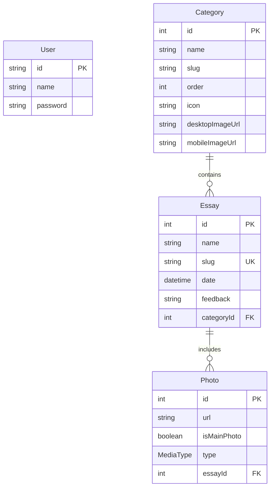
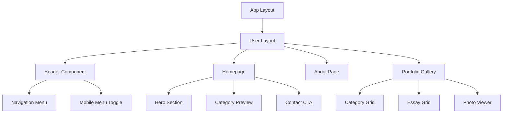
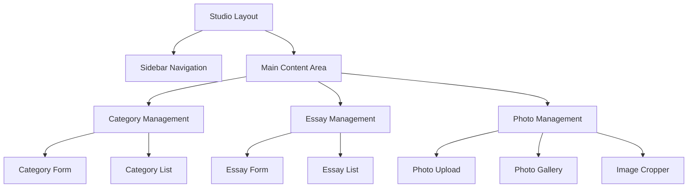
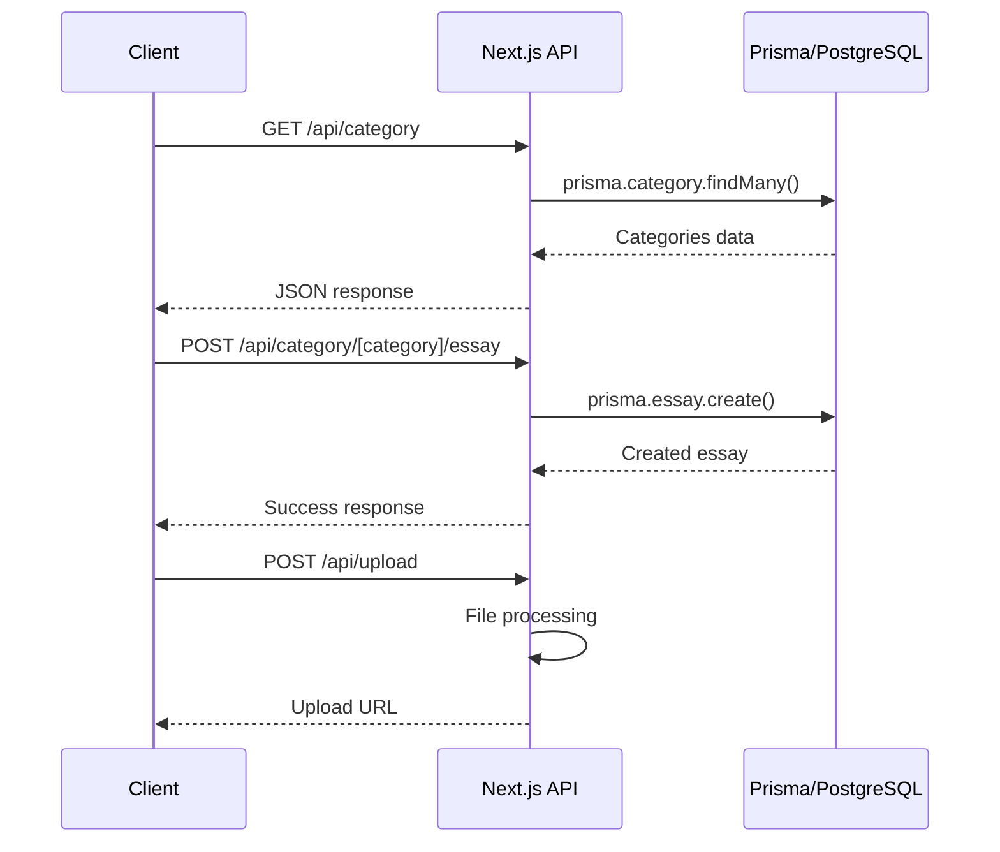
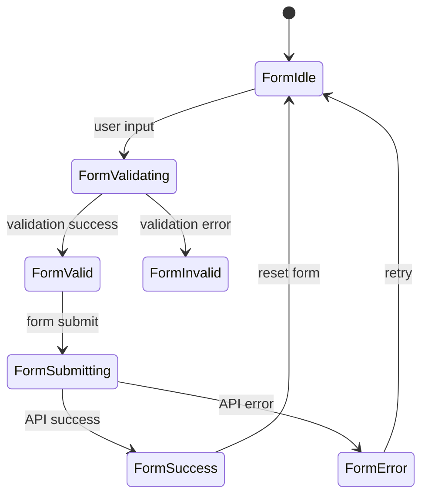
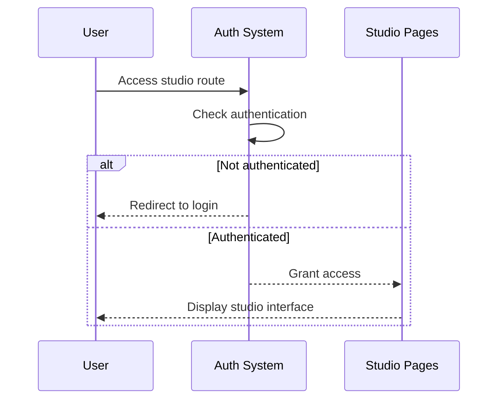

# Portfolio Website Design - Camila Menezes Photography

## Overview

This document outlines the design for enhancing Camila Menezes' photography portfolio website. The application is built using Next.js 15 with a full-stack architecture, featuring both public portfolio views and an admin studio for content management. The system allows Camila to showcase her photography work across different categories while providing visitors with an elegant browsing experience.

### Core Objectives
- Display photography portfolio with category-based organization
- Provide content management capabilities through admin studio
- Ensure responsive design for optimal mobile and desktop experience
- Enable client testimonials and contact functionality
- Maintain performance optimization for image-heavy content

## Technology Stack & Dependencies

### Frontend Framework
- **Next.js 15.4.5** - React framework with App Router
- **React 19.1.0** - UI library
- **TypeScript** - Type safety and development experience

### Styling & UI
- **Tailwind CSS 4** - Utility-first CSS framework
- **Framer Motion 12.23.12** - Animations and transitions
- **Radix UI** - Accessible component primitives (Dialog, Popover, Slot)
- **React Icons 5.5.0** - Icon library
- **Class Variance Authority** - Component variant management

### Backend & Database
- **Prisma 6.13.0** - Database ORM
- **PostgreSQL** - Primary database
- **Next.js API Routes** - Backend API endpoints

### Form Management & Validation
- **React Hook Form 7.62.0** - Form state management
- **Zod 4.0.14** - Schema validation
- **@hookform/resolvers** - Form validation integration

### File Management & Communication
- **React Email** - Email template system
- **EmailJS** - Client-side email service
- **React Cropper** - Image cropping functionality
- **UUID4** - Unique identifier generation

## Architecture

### Application Structure

```
camilaretrata/
├── src/app/
│   ├── (user)/              # Public portfolio routes
│   │   ├── page.tsx         # Homepage
│   │   ├── about/           # About page
│   │   └── layout.tsx       # Public layout
│   ├── (studio)/            # Admin content management
│   │   └── studio/          # Studio dashboard
│   └── api/                 # Backend API routes
├── prisma/                  # Database schema & migrations
├── public/                  # Static assets
└── emails/                  # Email templates
```

### Route Groups Architecture

```mermaid
graph TB
    A[Root Layout] --> B[(user) - Public Routes]
    A --> C[(studio) - Admin Routes]
    
    B --> D[Homepage]
    B --> E[About Page]
    B --> F[Portfolio Gallery]
    B --> G[Contact]
    
    C --> H[Studio Dashboard]
    C --> I[Category Management]
    C --> J[Essay Management]
    C --> K[Photo Upload]
    
    A --> L[API Routes]
    L --> M[Category API]
    L --> N[Essay API]
    L --> O[Upload API]
    L --> P[Email API]
```

## Data Models & ORM Mapping

### Database Schema



### Entity Relationships
- **Category**: Photography categories (e.g., "Retratos", "Casamentos", "Eventos")
- **Essay**: Individual photo shoots or collections within categories
- **Photo**: Individual images within essays, supporting both IMAGE and VIDEO types
- **User**: Admin users for studio access (authentication system)

### Data Access Patterns
- Categories ordered by `order` field for display sequence
- Essays filtered by category slug for portfolio navigation
- Photos with `isMainPhoto` flag for thumbnail display
- Slug-based routing for SEO-friendly URLs

## Component Architecture

### Public Components Hierarchy



### Studio Components Hierarchy



### Reusable UI Components

#### Button Component System
```typescript
interface ButtonProps {
  variant: 'primary' | 'secondary' | 'ghost'
  size: 'sm' | 'md' | 'lg'
  children: React.ReactNode
  onClick?: () => void
}
```

#### Form Component System
```typescript
interface FormProps {
  schema: ZodSchema
  onSubmit: (data: any) => void
  children: React.ReactNode
}
```

#### Input Component System
```typescript
interface InputProps {
  type: 'text' | 'textarea' | 'date' | 'media' | 'multipleMedia'
  label: string
  name: string
  validation?: ZodType
}
```

### Props/State Management

#### Category State Management
- Category selection drives essay filtering
- Order management for category display sequence
- Image URL management for responsive display

#### Essay State Management
- Form state for essay creation/editing
- Photo collection management within essays
- Main photo selection for thumbnails

#### Photo Upload State Management
- Multi-file upload progress tracking
- Image cropping state management
- Media type selection (IMAGE/VIDEO)

## API Integration Layer

### REST API Architecture



### API Endpoints Reference

#### Category Management
- `GET /api/category` - Retrieve all categories
- `POST /api/category` - Update category information
- `GET /api/category/[category]` - Get specific category
- `POST /api/category/[category]/essay` - Create new essay in category
- `GET /api/category/[category]/essay/[essayId]` - Get specific essay

#### File Upload
- `POST /api/upload` - Handle image/video uploads

#### Email Communication
- `POST /api/email` - Send contact form emails

### Request/Response Schema

#### Category Response
```typescript
interface CategoryResponse {
  id: number
  name: string
  slug: string
  order: number
  icon: string
  desktopImageUrl: string
  mobileImageUrl: string
  essays?: Essay[]
}
```

#### Essay Response
```typescript
interface EssayResponse {
  id: number
  name: string
  slug: string
  date: string
  feedback: string
  categoryId: number
  photos: Photo[]
}
```

#### Authentication Requirements
- Studio routes require authentication middleware
- Public routes are accessible without authentication
- File upload endpoints require admin authentication

## Routing & Navigation

### Public Navigation Structure

```mermaid
graph LR
    A[Homepage /] --> B[About /about]
    A --> C[Portfolio Categories]
    C --> D[Category View /[category]]
    D --> E[Essay View /[category]/[essay]]
    A --> F[Contact Form]
```

### Studio Navigation Structure

```mermaid
graph LR
    A[Studio Dashboard /studio] --> B[Categories /studio/retratos]
    B --> C[New Essay /studio/[category]/new]
    B --> D[Edit Essay /studio/[category]/[essayId]]
    B --> E[Essay Form /studio/[category]/edit]
```

### Route Parameters
- `[category]` - Dynamic category slug routing
- `[essayId]` - Specific essay identification
- Route groups `(user)` and `(studio)` for layout separation

### Navigation Components
- Desktop horizontal navigation with logo center
- Mobile hamburger menu with slide-out drawer
- Breadcrumb navigation in studio interface
- Category-based navigation in portfolio sections

## Styling Strategy

### Tailwind CSS Configuration
- Custom color palette with accent colors
- Responsive breakpoint system (mobile-first)
- Typography scale for photography presentations
- Animation utilities via Framer Motion integration

### Visual Design System
- Black/white primary color scheme with accent highlights
- High-contrast design for photography focus
- Smooth transitions and hover effects
- Mobile-responsive image galleries

### Component Styling Patterns
```typescript
// Using class-variance-authority for component variants
const buttonVariants = cva(
  "inline-flex items-center justify-center rounded-md",
  {
    variants: {
      variant: {
        default: "bg-primary text-primary-foreground",
        secondary: "bg-secondary text-secondary-foreground",
        ghost: "hover:bg-accent hover:text-accent-foreground",
      },
      size: {
        default: "h-10 px-4 py-2",
        sm: "h-9 rounded-md px-3",
        lg: "h-11 rounded-md px-8",
      },
    }
  }
)
```

## State Management

### Local State Management
- React Hook Form for form state management
- useState for component-level state
- useEffect for data fetching and side effects

### Server State Management
- Next.js built-in caching via `revalidate`
- Prisma query optimization for database interactions
- Static generation for public portfolio pages

### Form State Flow



## Business Logic Layer

### Category Management Logic
- Category ordering system for portfolio presentation
- Slug generation for SEO-friendly URLs
- Responsive image management (desktop/mobile variants)

### Essay Management Logic
- Date-based organization of photo shoots
- Main photo selection for category thumbnails
- Client feedback integration for testimonials

### Photo Processing Logic
- Multi-format support (IMAGE/VIDEO)
- Image cropping and optimization
- Bulk upload with progress tracking

### Authentication Flow


## Testing Strategy

### Unit Testing Approach
- Component testing with React Testing Library
- API endpoint testing with Jest
- Database query testing with Prisma test environment
- Form validation testing with Zod schemas

### Test Coverage Areas
- Form submission and validation
- Image upload functionality
- Category and essay CRUD operations
- Responsive navigation components
- Email template rendering

### Testing Tools Integration
```typescript
// Example test structure
describe('Category Management', () => {
  test('should create new category', async () => {
    // Test category creation logic
  })
  
  test('should validate category form', () => {
    // Test form validation
  })
  
  test('should handle image upload', async () => {
    // Test file upload functionality
  })
})
```

### Performance Testing
- Image loading optimization testing
- Mobile responsiveness validation
- Database query performance monitoring
- Bundle size optimization verification